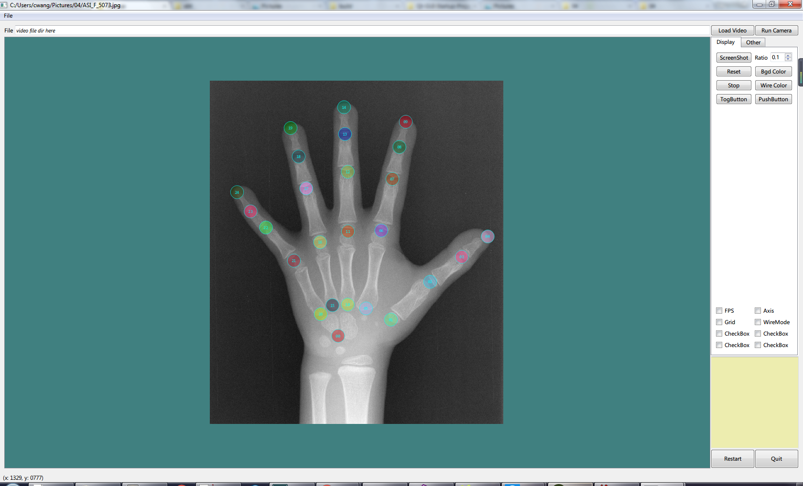

### A Startup Project for QT GUI Development

#### Prerequisite
- Qt 5.3
- VS2013
Should be okay in other platforms, but I didn't test it yet.

#### How to run
1. In `./src`, find the file `mainwindow.ui`, and generate the `.h` file by
```bash
uic -o ui_mainwindow.h mainwindow.ui
```

2. Run CMake to build the project. Then you will get a GUI like this:
